# NightyNight
## Demo
-------------
### Onboarding
We designed and drew our own onboarding interface. You can login with social media accounts as well. 
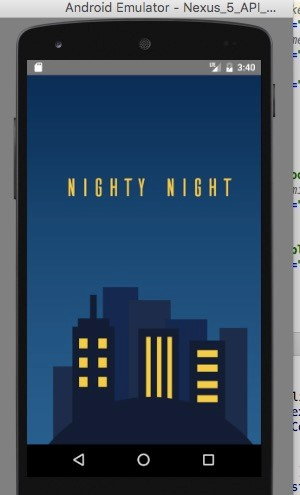
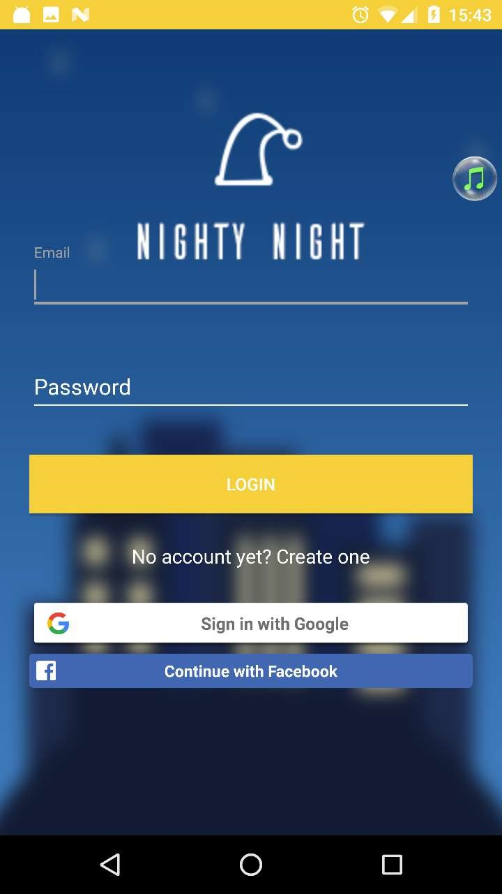

### Virtual Buildings
We added the social aspect by creating a virtual building where each friend is represented with a window with light on/off to indicate the sleeping status. 
Each building represent a friend group. 
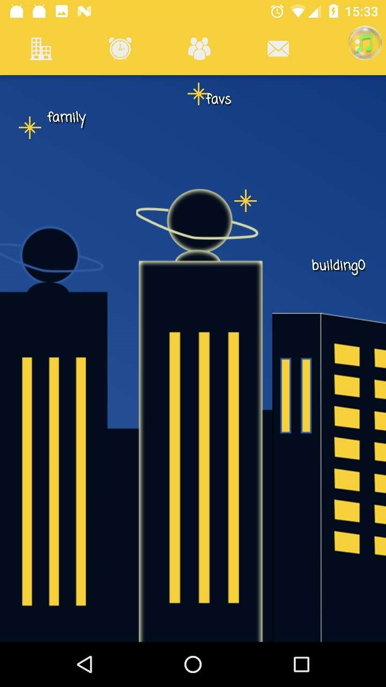
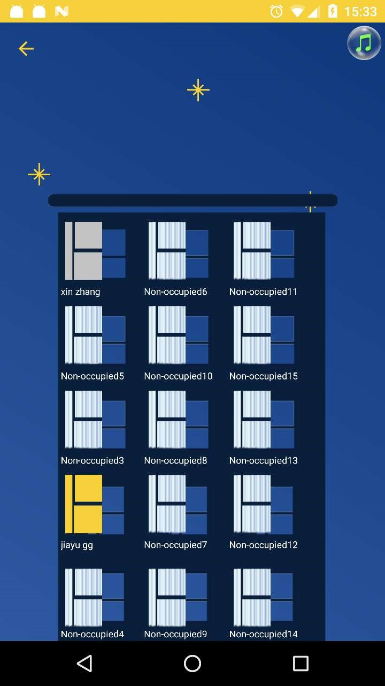
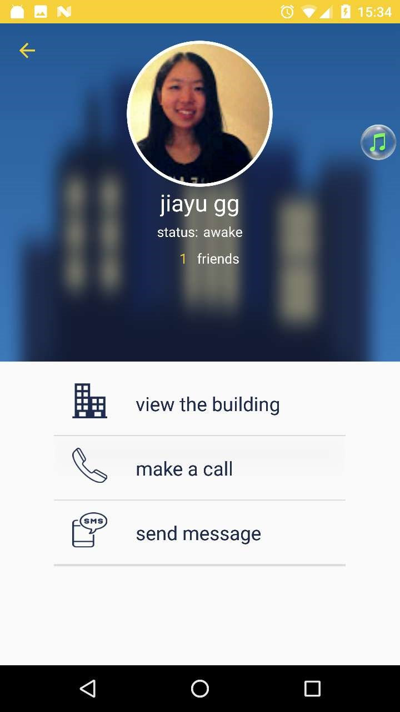

### Grouped friend list
You can add friends by looking up users with their emails. They will receive friend request in drop-down notification. 
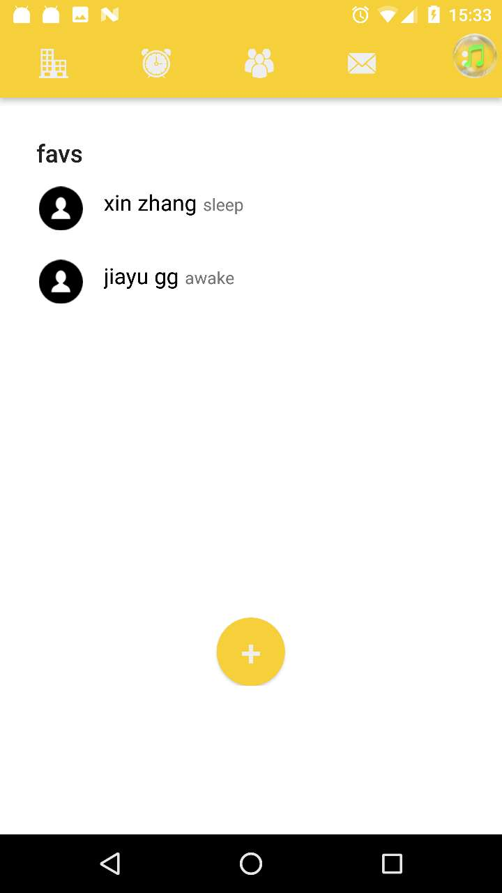

### Real-time chat
Nighty-night has a real-time chat system I implemented using Firebase; users can tap on the virtual windows of their
friends to chat or leave good morning messages for them to find out the next day
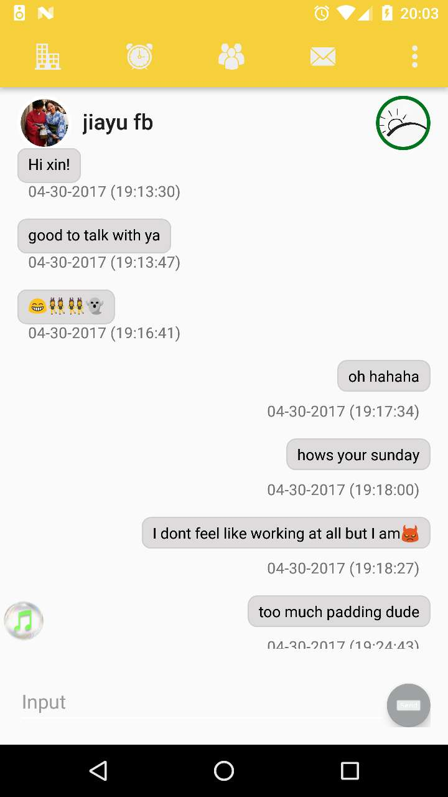

### Add alarm clocks
You can add/delete/edit your alarm clocks.
 
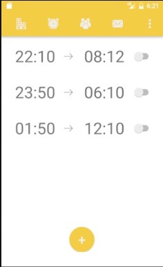
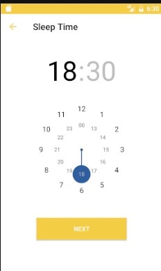
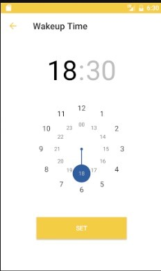
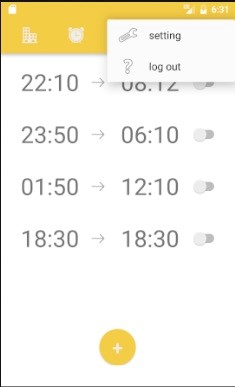

### Edit your profile
The hamburger menu enables user to logout or edit their profile. 
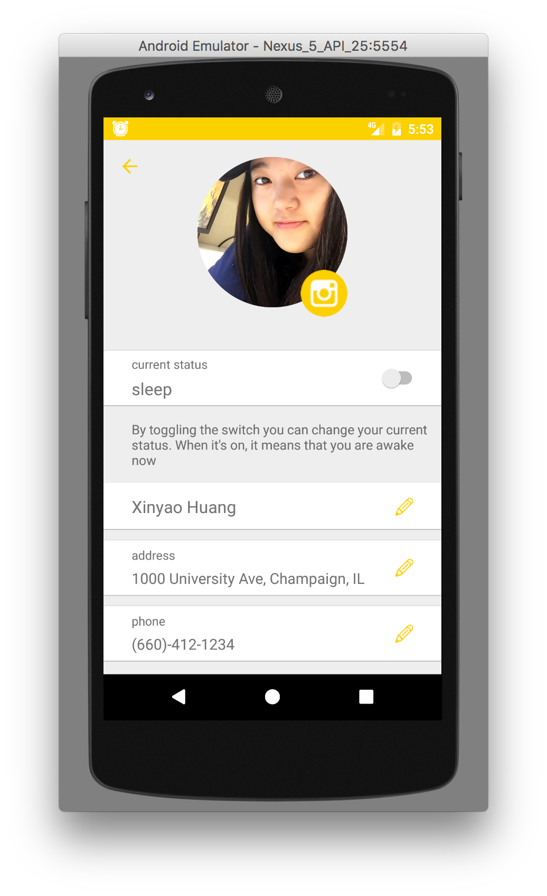

